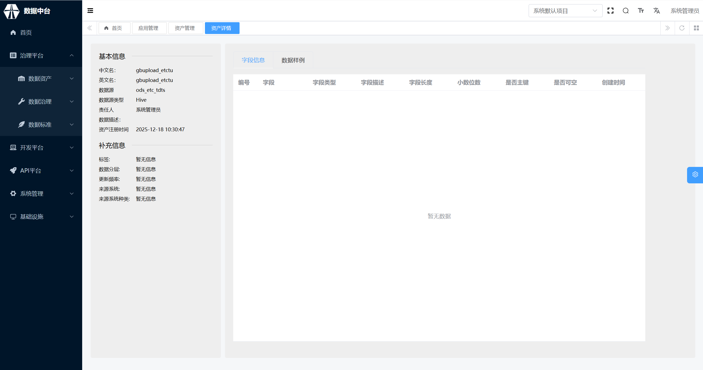

## 数据资产详情

在数据资产列表中，针对有权限查看的数据资产，可以查看资产详情，包含基本信息、补充信息、字段信息、血缘关系等。

1、资产基本信息——展示数据资产最重要的基本信息，如名称、负责人、描述、等。

2、资产补充信息——展示数据资产的其他补充信息，如标签、数据分层、更新频率等。

3、资产详细信息——展示数据资产内容的详细信息，包括字段信息、数据样例。

标题|说明
---|---
字段信息|可以查看资产的基本字段信息（字段名、字段类型、字段描述），和其他勘探信息（字段中文名、字段字典配置、字段数据元等）
数据样例|可以查看资产的样例数据（默认查看前10条）