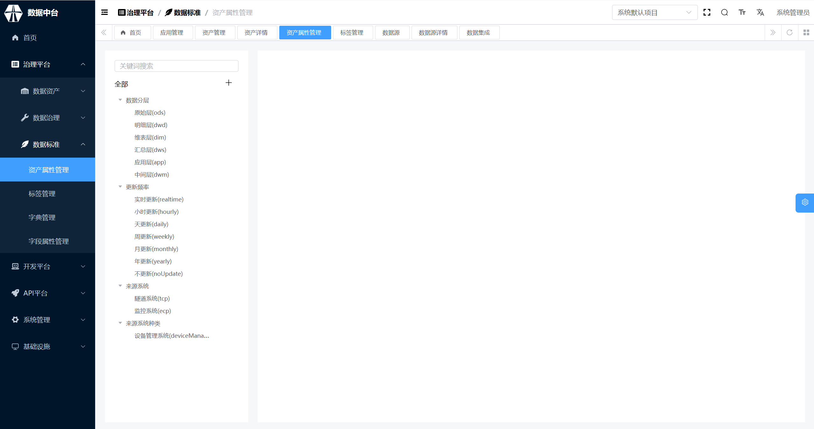
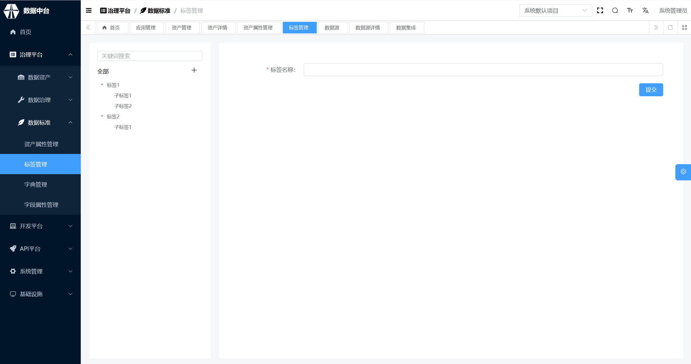
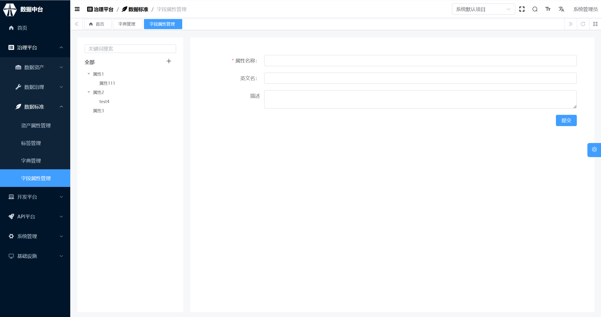

## 表标准

### 资产属性管理

资产属性管理用于管理数据仓库内存放的数据资产的基本属性和自定义属性，在该模块中定义的资产属性可以参与数据勘探，由治理工为每一份数据资产明确其基本属性和自定义属性。

1、当鼠标悬停在“全部”后面的+号时可以新增自定义数据资产属性；

2、当鼠标悬停在具体的资产属性上时可以增加资产属性下的取值以及删除资产属性。部分系统内置资产属性不可删除，包括主题域、来源系统、数据分层、更新频率、部标分类、数据元标准、限定词标准；

3、勘探填写约束：决定在数据勘探时是否需要填写该资产属性，以及是选填还是必填。勘探填写约束只有自定义属性可填；

4、勘探预览：完成所有资产属性编辑后可以点击勘探预览查看数据勘探页面需要填写的内容，确认资产属性设置是否有误。

**数据分层**
数据分层表示数据位于数仓的哪一层。数仓分层是数据仓库设计中十分重要的一个环节，优秀的分层设计能够让整个数据体系更容易理解和使用。

一般情况下，将数据模型分为4层

①数据运营层ODS：存放的是接入的原始数据。经过ETL之后装入本层，大多是按照源头业务系统的分类方式而分类的。为了考虑后续可能追溯数据为题，因此对这一层不建议做过多的数据清洗工作，原封不动接入源数据即可，至于数据的去噪，去重，异常值处理等过程可以放在后面的DW层

②数据仓库层DW：重点设计的数据仓库中间层数据，在这里ODS层获得的数据按照主题建立各种数据模型，DW又细分 Ⅰ. 数据明细层：DWD(Data WareHouse Detail) 该层一般保持和ODS层一样的数据粒度，并且提供给一定的数据质量保证。同时为了提高数据明细层的易用性，该层会采用一些维度退化手法，将维度退化到事实表中，减少事实表和维度表的关联。另外，在该层也会做一部分的数据聚合，将相同主题的数据汇集到一张表中，提高数据的可用性 Ⅱ. 数据中间层：DWM（Data WareHouse Middle） 在DWD层的数据基础上，对数据做轻度的聚合操作，生成一系列的中间表提升公共指标的复用性，减少重复加工，直观来说，就是对通用的核心维度进行聚合操作，算出相应的统计指标 Ⅲ. 数据服务层：DWS(Data WareHouse Service) 又称为数据集市或者宽表，按照业务划分，例如流量，订单，用户等，生成字段比较多的宽表，用于后续的业务查询，OLAP分析，数据分析等。

在实际计算中，如果直接从DWD或者ODS计算宽表的统计指标，会存在计算量太大并且维度太少的问题。一般做法是。在DWM层先计算出多个小的中间表，再拼接成一张DWS的大宽表。由于宽和窄的界限不易界定，也可以去掉DWM这一层，只保留DWS层，将所有的数据放在DWS亦可 一般采用维度模型方法作为理论基础，更多的采用一些维度退化手法，将维度退化至事实表中，减少维度表与事实表的关联，提高明细数据表的易用性；同时在汇总数据层要加强指标的维度退化，采用更多的宽表化手段构建公共指标数据层，提升公共指标的复用性，减少重复加工

例如： 表1： 姓名，城市，年龄 表2： 姓名，订单，订单金额

退化成宽表： 姓名，城市，年龄，订单，订单金额

维度退化简单来说就是把维度对应的描述直接放在事实表中，使用时不再关联维度表，把表做宽，查询更方便

③数据应用层APP：面向业务定制的应用数据 主要提供给数据铲平和数据分析使用的数据，一般会放在ES、MYSQL、Redis等系统供线上系统使用，也可以放在Hive中供数据分析和数据挖掘使用

④维表层 Dimension 1、高基数维度数据：一般是用户资料表，商品资料表类似的资料表。数据量可能是千万级或者上亿级别 2、低基数维度数据：一般是配置表，比如枚举值对应的中文含义，或者日期维表。数据量可能是个位数或者几千几万

**来源系统**
来源系统表示数据来源于哪个系统，常见的例如CRM系统、订单系统等。一般在数据仓库构建之初，需要梳理数据都来自于哪些业务系统、各业务系统中的数据口径等。

**更新频率**
更新频率指数据的更新频率，离线场景下常见的更新频率为每天更新、每周更新、每月更新，实时场景下常见的更新频率为实时更新、每小时更新。更新频率可以自定义。

### 标签管理

标签用于对资产进行标记，一份资产可以有多个标签，当在资产地图查找资产时可以根据标签进行查找。

1、数据标签制定，支持树状标签

2、编辑标签名称

## 字段标准

### 字典管理

字典用于对一些内部有枚举值或者有编码的字段进行翻译。如某个字段内部0代表男性，1代表女性，需要绑定一个字典，用于后续的翻译。

（1）点击字典或分类名称可以查看详细信息

（2）点击加号可选择新建分类或新建字典

### 字段属性管理

字段属性用于对字段进行分类，类似资产属性对资产的标记作用。

（1）新增属性

（2）编辑属性