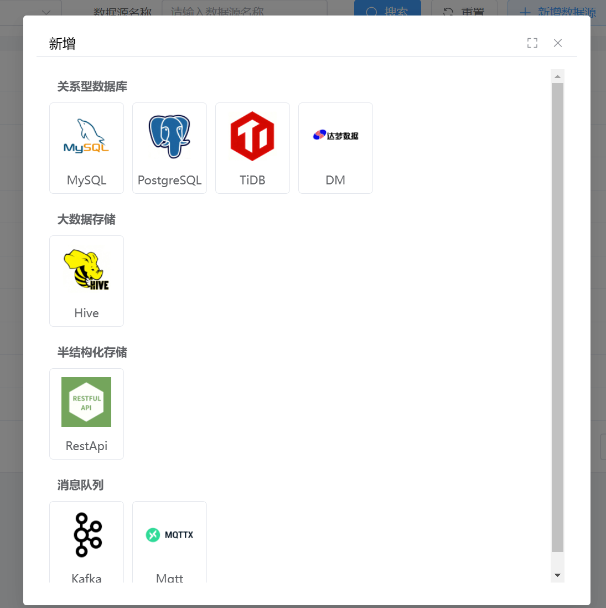
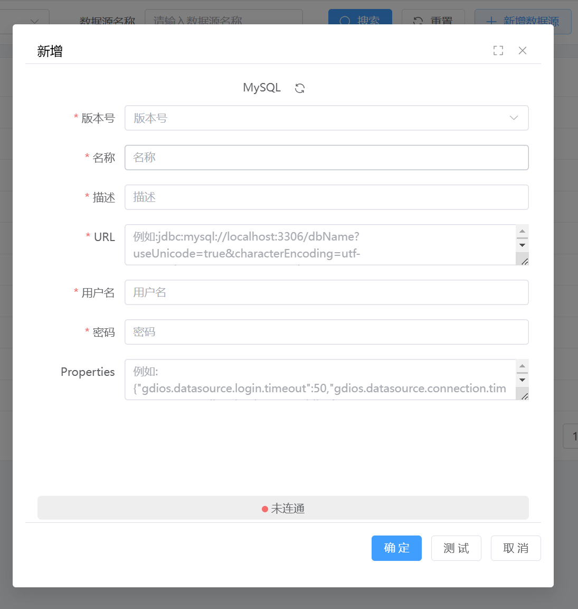
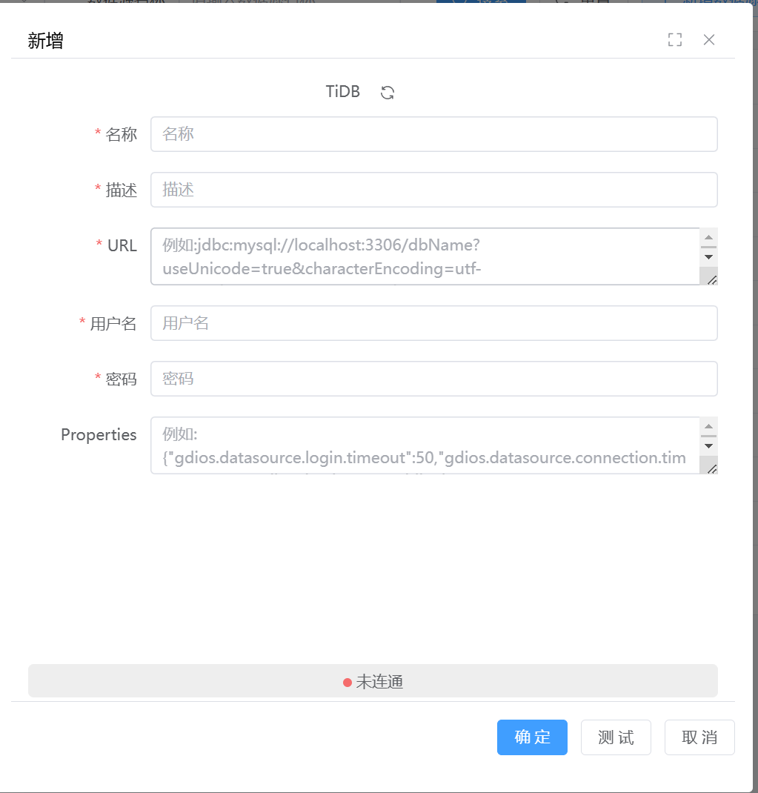
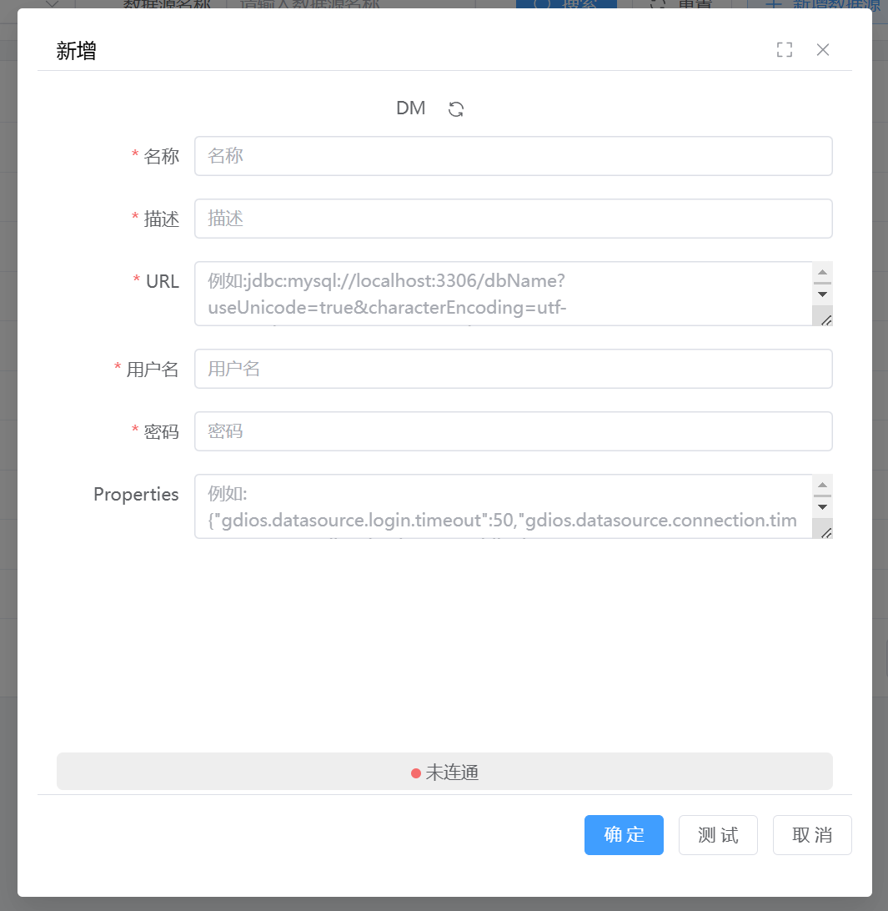
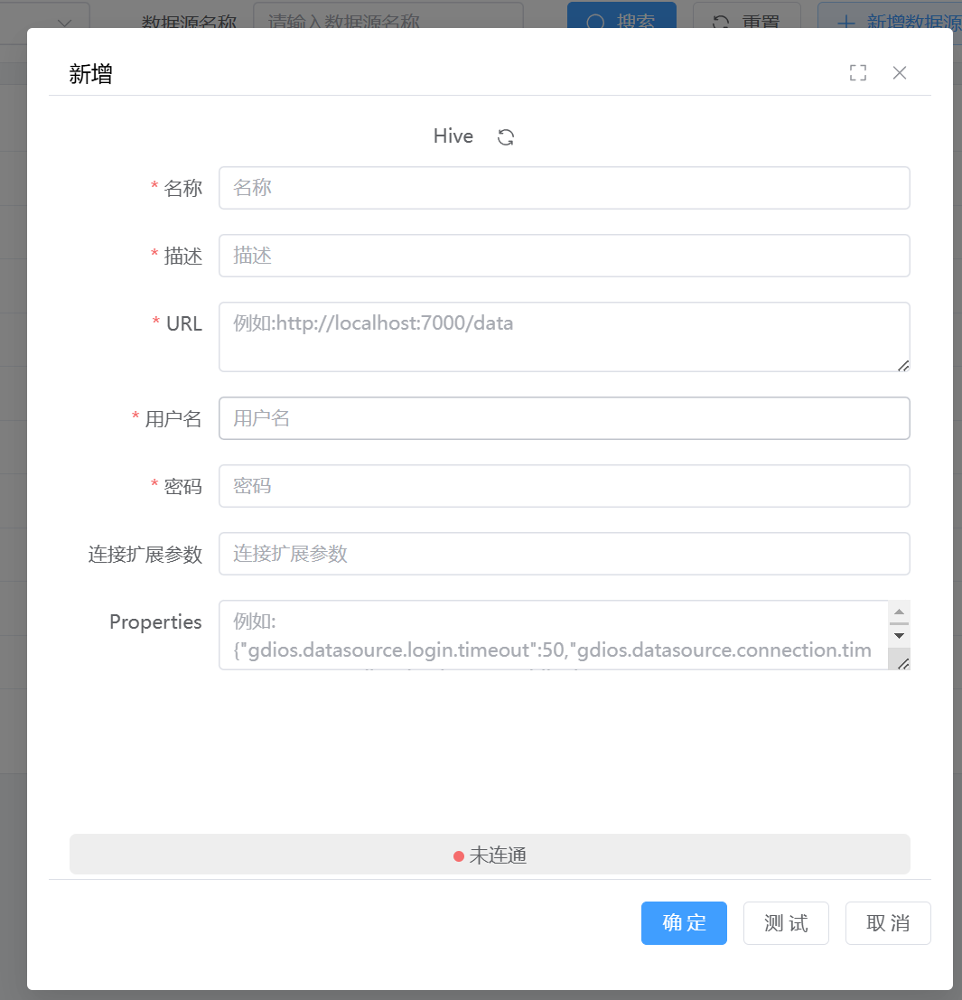
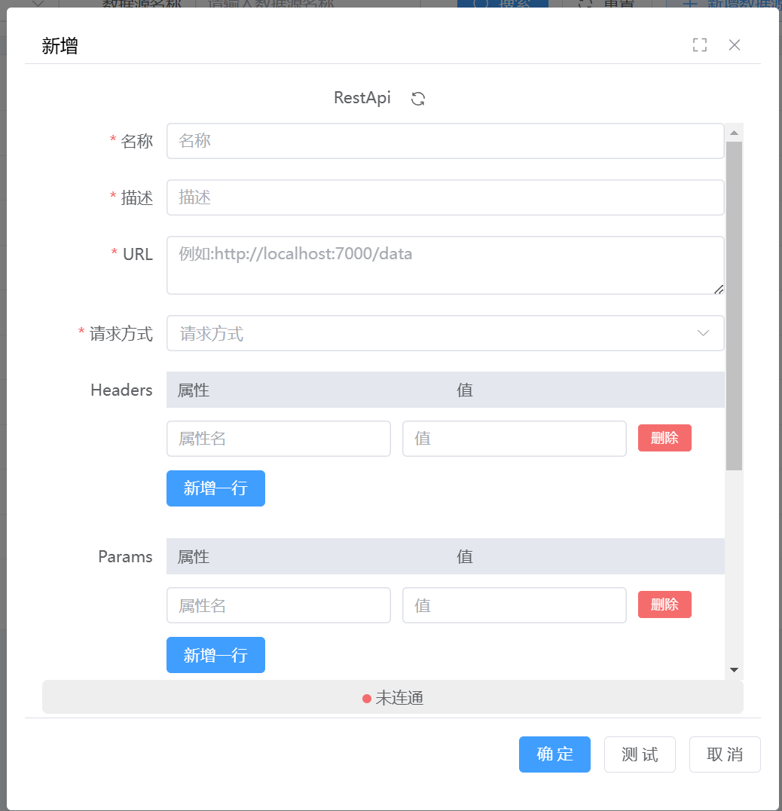
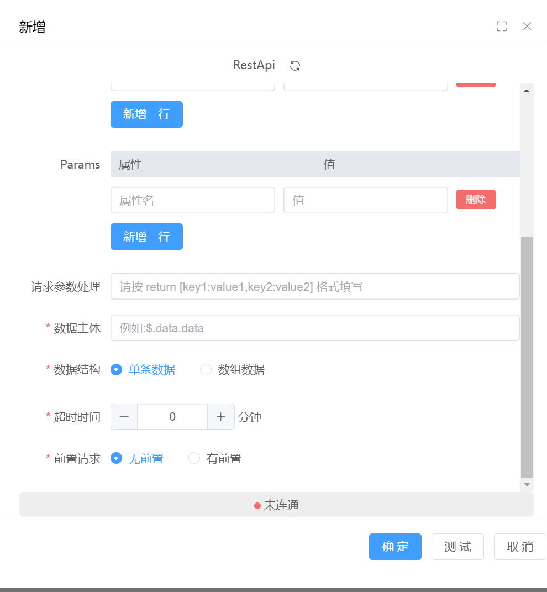
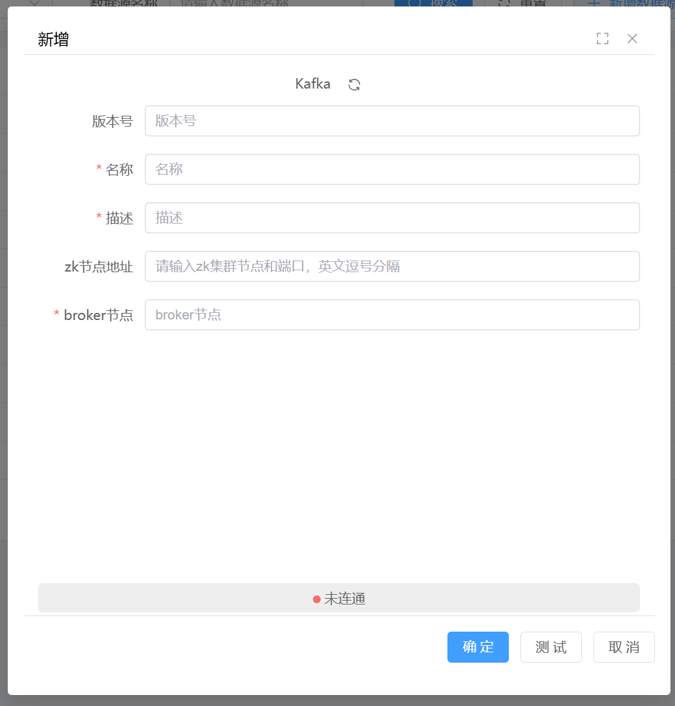

## 数据源

 **简介**

此文档进行不同数据源的详细注册事项的说明，提供示例。

数据源信息填写完成后，需要测试连接是否可用。测试通过后，可以查看里面的数据详情；测试不通过，说明有内容填错，需要重新修改。

可新增数据源如图所示

### 数据库创建

### 关系型数据库

#### MySQL

1、选择Mysql版本号，目前支持5.x和8.x

2、填写数据源名称和描述

3、填写URL，例如：jdbc:mysql://192.168.10.38:3306

4、填写用户名和密码

#### PostgreSQL

1、填写数据源名称和描述

2、填写URL，例如：jdbc:postgresql://192.168.10.15:2346/datapan

3、填写用户名和密码

#### TiDB

1、填写数据源名称和描述

2、填写URL，例如：jdbc:postgresql://192.168.10.15:2346/datapan

3、填写用户名和密码

#### DM

1、填写数据源名称和描述

2、填写URL，例如：jdbc:postgresql://192.168.10.15:2346/datapan

3、填写用户名和密码

### 大数据存储

#### Hive

1、填写数据源名称和描述

2、填写URL，例如：jdbc:postgresql://192.168.10.15:2346/datapan

3、填写用户名和密码

### 半结构化存储

#### RestApi

1、填写数据源名称和描述

2、填写URL，例如：http://localhost:7000/data

3、选择请求方式，可选择 POST/GET

4、填写数据主体，例如：$.data.data

5、选择数据结构，可选择 单条数据/数组数据

6、选择超时时间（分钟）

7、选择前置请求 无前置/有前置

8、有前置则填写前置请求

### 消息队列
#### Kafka

1、填写集群名称

2、选择Kafka版本，目前支持0.8.x、0.9.x、1.x

3、填写zk集群节点和端口，例如：192.168.11.253:2181,192.168.11.254:2181

4、填写broker节点地址，例如192.168.11.99:30018

#### Mqtt

1、填写数据源名称和描述

2、填写broker节点地址，例如192.168.11.99:30018

3、填写topic，例如：sensors/temperature/room1,sensors/humidity/room2,actuators/light/switch

4、填写用户名和密码

### 已有数据库查看

可直接查看数据源名称、类型、描述，更新时间、连通状态。

单击已连通数据源的详情可查看数据源库、表的字段详情和数据样例。

## 数据集成
一、简介

此文档主要描述数据集成功能使用的建议，并提供示例。

二、数据接入准备

1、数据源与DIOS之间网络互通

测试方法：

&emsp;&emsp;1.ping ip/host 检查双方主机是否能正常通信；

&emsp;&emsp;2.telnet ip port 检查端口号是否正常通信；

&emsp;&emsp;3.对应的server端是否有ip白名单的设置。

2、数据源链接地址正确，账号密码或其他登陆身份正确

测试方法：

&emsp;&emsp;1.使用常见的图形化工具测试是否能够正常联通，或对比其他业务场景在使用的账号密码是否一致

3、明确待接入表基本信息

&emsp;&emsp;1.用户需了解对待接入表的数据规模、表结构等基本信息：

&emsp;&emsp;2.明确待接入表数据总量；

&emsp;&emsp;3.明确待接入表更新方式，有无自增属性的字段（自增id、时间、用户id等）。