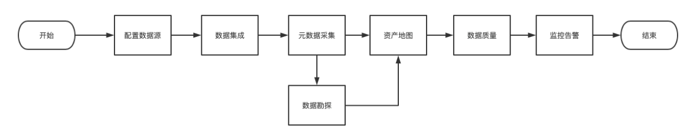
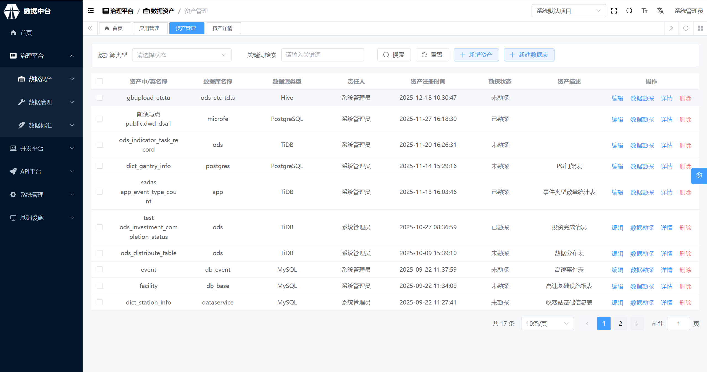
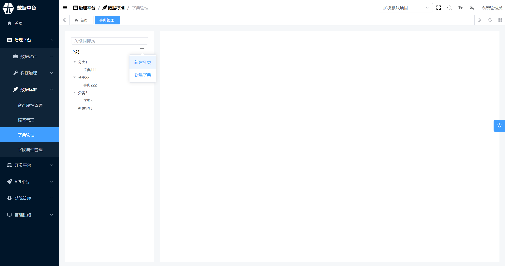

# 总体简介

## 治理平台
治理平台提供数据源注册、数据集成、数据标准制定、数据勘探、数据资产管理等功能，助力企业方便快捷地建设数据资产中心。

菜单：数据资产、数据治理、数据标准
## 开发平台
开发平台可支持多语言实时/离线任务开发、定时执行、任务监控告警等功能，充分提升数据开发人员开发效率。

菜单：自主分析、离线任务、实时任务
## API平台
API平台提供创建API、API管理、API授权、使用统计等功能。通过页面上的简单配置即可将企业已有的数据快速生成API，供业务人员调用，达到提高数据服务效率，加快数据能力交付的效果。

菜单：API统计、API开发、API管理

# 产品手册

## 第一章： 治理平台
### 概述
使用治理平台进行数据治理，推荐使用以下标准流程进行。

数据治理平台主要包含以下功能：

1、数据资产

​ 1.1 数据资产大屏。对数据资产进行统计和展示。

​ 1.2 数据血缘。可查找各类数据（表、任务、文件、API）的上下游连接信息。

​ 1.3 我的收藏。可查看收藏的数据资产详情。

​ 1.4 数据资产管理。对数据资产进行筛选搜索、分区管理、数据勘探、删除等操作。

2、数据治理

​ 2.1 数据源管理。数据源管理用于数据源的注册、管理、表格信息采集和表格创建。

​ 2.1.1 数据源新增

​ 2.1.2 数据源查看

​ 2.1.3 数据源删除

​ 2.2 数据洞察。数据洞察用于对数据进行初步的了解。

​ 2.3 数据集成。数据集成用于将不同数据源的数据存放到同一数据储存中，以便后续进行数据挖掘。

​ 2.3.1 数据集成列表，用于展现已有的集成作业

​ 2.3.2 新建数据集成，用于新建集成作业

​ 2.3.3 管理集成作业，用于对已有数据的增删改查

​ 2.3.4 任务分类管理，用于对数据集成作业进行分类

​ 2.3.5 函数分类管理，用于对数据集成UDF函数进行分类

​ 2.4 数据勘探。给数据打上表格标签和字段标签，完成对数据元数据探查和业务探查。

​ 2.5 数据质量。数据质量用于配置对数据资产的质量统计指标。

​ 2.6 监控告警。监控告警用于对数据质量指标进行监控和通过不同方式向用户发送通知。

3、数据标准

数据标准模块提供了制定数据进行打标签所需标准的功能。主要包含对表的描述和对字段的描述两部分。

​ 3.1 表标准

​ 3.1.1 资产属性管理：定义数仓的分层、主题域、表名结构规范等，支持自定义新增资产属性和加入数据勘探。

​ 3.1.2 标签管理：为数据打上树状标签，用于标识表格的业务属性等；注意：同一个数据可以打上多个标签。

​ 3.2、字段标准

​ 3.2.1 资产属性管理：用于描述数据的更新频率、来源等

​ 3.2.2 标签管理：用于字段的一种补充描述

​ 3.2.3 字典管理：用于对字段的内容进行翻译的信息，类似于数据维表

​ 3.2.4 字段属性管理：用作字段的分类

4、资源管理

​ 4.1 文件管理。可搜索、查看文件详情，也可新建文件夹、上传文件。

​ 4.2 UDF资源管理。对UDF文件的管理，可搜索、查看文件详情，也可上传文件。

​ 4.3 函数管理。新建或编辑UDF文件中的函数

### 第一节 数据资产

#### 数据资产详情

在数据资产列表中，针对有权限查看的数据资产，可以查看资产详情，包含基本信息、补充信息、字段信息、血缘关系等。

1、资产基本信息——展示数据资产最重要的基本信息，如名称、负责人、描述、等。

2、资产补充信息——展示数据资产的其他补充信息，如标签、数据分层、更新频率等。

3、资产详细信息——展示数据资产内容的详细信息，包括字段信息、数据样例。

标题|说明
---|---
字段信息|可以查看资产的基本字段信息（字段名、字段类型、字段描述），和其他勘探信息（字段中文名、字段字典配置、字段数据元等）
数据样例|可以查看资产的样例数据（默认查看前10条）

### 第二节 数据治理

#### 数据源

 **简介**

此文档进行不同数据源的详细注册事项的说明，提供示例。

数据源信息填写完成后，需要测试连接是否可用。测试通过后，可以查看里面的数据详情；测试不通过，说明有内容填错，需要重新修改。

可新增数据源如图所示

##### 数据库创建

##### 关系型数据库

###### MySQL

1、选择Mysql版本号，目前支持5.x和8.x

2、填写数据源名称和描述

3、填写URL，例如：jdbc:mysql://192.168.10.38:3306

4、填写用户名和密码

###### PostgreSQL

1、填写数据源名称和描述

2、填写URL，例如：jdbc:postgresql://192.168.10.15:2346/datapan

3、填写用户名和密码

###### TiDB

1、填写数据源名称和描述

2、填写URL，例如：jdbc:postgresql://192.168.10.15:2346/datapan

3、填写用户名和密码

###### DM

1、填写数据源名称和描述

2、填写URL，例如：jdbc:postgresql://192.168.10.15:2346/datapan

3、填写用户名和密码

##### 大数据存储

###### Hive

1、填写数据源名称和描述

2、填写URL，例如：jdbc:postgresql://192.168.10.15:2346/datapan

3、填写用户名和密码

##### 半结构化存储

###### RestApi

1、填写数据源名称和描述

2、填写URL，例如：http://localhost:7000/data

3、选择请求方式，可选择 POST/GET

4、填写数据主体，例如：$.data.data

5、选择数据结构，可选择 单条数据/数组数据

6、选择超时时间（分钟）

7、选择前置请求 无前置/有前置

8、有前置则填写前置请求

##### 消息队列
###### Kafka

1、填写集群名称

2、选择Kafka版本，目前支持0.8.x、0.9.x、1.x

3、填写zk集群节点和端口，例如：192.168.11.253:2181,192.168.11.254:2181

4、填写broker节点地址，例如192.168.11.99:30018

###### Mqtt

1、填写数据源名称和描述

2、填写broker节点地址，例如192.168.11.99:30018

3、填写topic，例如：sensors/temperature/room1,sensors/humidity/room2,actuators/light/switch

4、填写用户名和密码

##### 已有数据库查看

可直接查看数据源名称、类型、描述，更新时间、连通状态。

单击已连通数据源的详情可查看数据源库、表的字段详情和数据样例。

#### 数据集成
一、简介

此文档主要描述数据集成功能使用的建议，并提供示例。

二、数据接入准备

1、数据源与DIOS之间网络互通

测试方法：

&emsp;&emsp;1.ping ip/host 检查双方主机是否能正常通信；

&emsp;&emsp;2.telnet ip port 检查端口号是否正常通信；

&emsp;&emsp;3.对应的server端是否有ip白名单的设置。

2、数据源链接地址正确，账号密码或其他登陆身份正确

测试方法：

&emsp;&emsp;1.使用常见的图形化工具测试是否能够正常联通，或对比其他业务场景在使用的账号密码是否一致

3、明确待接入表基本信息

&emsp;&emsp;1.用户需了解对待接入表的数据规模、表结构等基本信息：

&emsp;&emsp;2.明确待接入表数据总量；

&emsp;&emsp;3.明确待接入表更新方式，有无自增属性的字段（自增id、时间、用户id等）。

### 第三节 数据标准

#### 表标准

##### 资产属性管理

资产属性管理用于管理数据仓库内存放的数据资产的基本属性和自定义属性，在该模块中定义的资产属性可以参与数据勘探，由治理工为每一份数据资产明确其基本属性和自定义属性。

1、当鼠标悬停在“全部”后面的+号时可以新增自定义数据资产属性；

2、当鼠标悬停在具体的资产属性上时可以增加资产属性下的取值以及删除资产属性。部分系统内置资产属性不可删除，包括主题域、来源系统、数据分层、更新频率、部标分类、数据元标准、限定词标准；

3、勘探填写约束：决定在数据勘探时是否需要填写该资产属性，以及是选填还是必填。勘探填写约束只有自定义属性可填；

4、勘探预览：完成所有资产属性编辑后可以点击勘探预览查看数据勘探页面需要填写的内容，确认资产属性设置是否有误。

**数据分层**
数据分层表示数据位于数仓的哪一层。数仓分层是数据仓库设计中十分重要的一个环节，优秀的分层设计能够让整个数据体系更容易理解和使用。

一般情况下，将数据模型分为4层

①数据运营层ODS：存放的是接入的原始数据。经过ETL之后装入本层，大多是按照源头业务系统的分类方式而分类的。为了考虑后续可能追溯数据为题，因此对这一层不建议做过多的数据清洗工作，原封不动接入源数据即可，至于数据的去噪，去重，异常值处理等过程可以放在后面的DW层

②数据仓库层DW：重点设计的数据仓库中间层数据，在这里ODS层获得的数据按照主题建立各种数据模型，DW又细分 Ⅰ. 数据明细层：DWD(Data WareHouse Detail) 该层一般保持和ODS层一样的数据粒度，并且提供给一定的数据质量保证。同时为了提高数据明细层的易用性，该层会采用一些维度退化手法，将维度退化到事实表中，减少事实表和维度表的关联。另外，在该层也会做一部分的数据聚合，将相同主题的数据汇集到一张表中，提高数据的可用性 Ⅱ. 数据中间层：DWM（Data WareHouse Middle） 在DWD层的数据基础上，对数据做轻度的聚合操作，生成一系列的中间表提升公共指标的复用性，减少重复加工，直观来说，就是对通用的核心维度进行聚合操作，算出相应的统计指标 Ⅲ. 数据服务层：DWS(Data WareHouse Service) 又称为数据集市或者宽表，按照业务划分，例如流量，订单，用户等，生成字段比较多的宽表，用于后续的业务查询，OLAP分析，数据分析等。

在实际计算中，如果直接从DWD或者ODS计算宽表的统计指标，会存在计算量太大并且维度太少的问题。一般做法是。在DWM层先计算出多个小的中间表，再拼接成一张DWS的大宽表。由于宽和窄的界限不易界定，也可以去掉DWM这一层，只保留DWS层，将所有的数据放在DWS亦可 一般采用维度模型方法作为理论基础，更多的采用一些维度退化手法，将维度退化至事实表中，减少维度表与事实表的关联，提高明细数据表的易用性；同时在汇总数据层要加强指标的维度退化，采用更多的宽表化手段构建公共指标数据层，提升公共指标的复用性，减少重复加工

例如： 表1： 姓名，城市，年龄 表2： 姓名，订单，订单金额

退化成宽表： 姓名，城市，年龄，订单，订单金额

维度退化简单来说就是把维度对应的描述直接放在事实表中，使用时不再关联维度表，把表做宽，查询更方便

③数据应用层APP：面向业务定制的应用数据 主要提供给数据铲平和数据分析使用的数据，一般会放在ES、MYSQL、Redis等系统供线上系统使用，也可以放在Hive中供数据分析和数据挖掘使用

④维表层 Dimension 1、高基数维度数据：一般是用户资料表，商品资料表类似的资料表。数据量可能是千万级或者上亿级别 2、低基数维度数据：一般是配置表，比如枚举值对应的中文含义，或者日期维表。数据量可能是个位数或者几千几万

**来源系统**
来源系统表示数据来源于哪个系统，常见的例如CRM系统、订单系统等。一般在数据仓库构建之初，需要梳理数据都来自于哪些业务系统、各业务系统中的数据口径等。

**更新频率**
更新频率指数据的更新频率，离线场景下常见的更新频率为每天更新、每周更新、每月更新，实时场景下常见的更新频率为实时更新、每小时更新。更新频率可以自定义。

##### 标签管理

标签用于对资产进行标记，一份资产可以有多个标签，当在资产地图查找资产时可以根据标签进行查找。

1、数据标签制定，支持树状标签

2、编辑标签名称

#### 字段标准

##### 字典管理

字典用于对一些内部有枚举值或者有编码的字段进行翻译。如某个字段内部0代表男性，1代表女性，需要绑定一个字典，用于后续的翻译。

（1）点击字典或分类名称可以查看详细信息

（2）点击加号可选择新建分类或新建字典

##### 字段属性管理

字段属性用于对字段进行分类，类似资产属性对资产的标记作用。

（1）新增属性

（2）编辑属性

## 第二章： 开发平台

### 概述

数据开发平台是一站式数据洞察、研发、资产管理的平台。DIOS数据开发平台为用户提供了界面化、智能高效的大数据的开发能力，支持Spark，Flink，Hive等多种引擎，帮助用户在探索分析场景、离线场景和实时场景中快速的支撑业务的需求，满足不同角色的用户的多样化开发和协作需求；同时支持容器化部署 ，快速实施安装部署，帮助企业快速进行数据加工和探索提供了基础。

#### 整体使用流程

#### 数据开发平台的主要功能

支持的功能|说明
---|---
开发|通过编写代码的方式实现各类数据分析或交互功能。
函数|通过创建函数并在任务中直接进行使用。
资源|用户通过上传资源使其可被函数或代码引用。
资产|通过资产功能快速查询预览现有数据资产表的结构和内容，并且支持快速生成查询语句。
系统管理|在此模块配置Interpreter和credential。

#### 数据开发平台名词解释

术语|描述
---|---
离线任务|依据调度设置在特定时机处理数据的任务。多个离线任务通过配置依赖关系组成工作流，以工作流为单位对数据进行加工处理。
实时任务|指现场数据一旦更新便实时对其进行收集和加工处理的任务，实时任务不存在工作流的概念。
离线开发|编写离线任务和调试运行任务。
实时开发|编写实时任务和调试运行任务。
探索分析|用户通过SQL、Python等进行数据分析工作（即席查询，自助取数，数据统计描述性分析 ），探索分析无法发布。
离线工作流|由一个或多个离线任务构建的工作流，离线任务之间存在依赖关系。
实时数据流|由一个或者多个可以执行的实时任务组成的集合。
配置工作流|为离线工作流中的各个任务添加依赖关系

### 第一节 自助分析

#### 开发平台页面区域划分

分组区：您可以在该区域选择分组内的项目进行编辑。

代码输入区：您可以在该区域直接进行代码编写，支持代码高亮和提示。

结果/运行历史区：您可以在这里看到任务运行日志及结果。

### 第二节 离线任务

#### 任务分组

进行任务分组创建

创建任务

工作流展示

节点：可拖拽节点至画布上使用
画布：放置节点，可对画布上的节点进行SQL语句编写，参数编译
观察：以阴影的形式展示节点在画布上的位置，方便用户寻找到节点所在

#### 任务调度

为创建好的任务设置一个执行时间段，使任务能在设定的时间里执行。

### 第三节 实时任务

新增实时任务

编辑实时任务界面

功能区 ：保存编写的代码，执行/停止执行代码

代码编写区：您可以在此区域进行代码的编写

结果区：您可以在此查看代码的运行结果、运行日志等信息

## 第三章： API平台

### 产品架构

提供创建API、API管理、API授权、使用统计等功能，帮助企业统一管理所有的API服务。数据服务平台提迅速将数据表开发成API的能力，同时支持快速注册现有的API至数据服务平台，进行统一的管理、发布、授权和管控等。

### 第一节 API开发

#### API列表

市场列表包括所有项目中的api，客户可以查看整个客户下面的所有api的基本信息。

api列表主要展现的是已经开发完成的api。同时支持对某个api进行查看，编辑，上线，测试，下线等操作。

#### 服务管理

##### API创建

 创建服务 1）在API平台页面，点击API开发>服务管理>新建服务 2）填写所需的服务名称与服务描述，点击确认

服务创建成功后，可在服务管理页面对其进行编辑、删除等操作。 2、 创建API 在API平台页面，点击API开发>API列表>+新增，此页面支持创建两种API类型。

1)数据服务API支持数据的查询和输入

数据查询：

在创建数据服务API对话框中，选择所需模式，配置各项参数。

参数|描述
---|---
API所属服务|API的业务属性服务分组(事件服务/ETC分组服务)
API名称|不得超过50个字符
API路径|API存放的路径，例如/getMyData*以/开头，字母、数字、_和-组成，字母数字结尾
请求方式|POST/GET
API描述|对API进行简要描述，不得超过200个字符
数据源类型|需要提前在数据集成中配置好数据源，数据表下拉列表支持表名搜索
数据源名称|同上
SQL库名|下拉列表中选择所需SQL库
编写SQL|填写SQL语句
请求参数|设置请求参数的参数类型（包括STRING、INT、LONG、FLOAT、DOUBLE、DATE、BOOLEAN和STRING_ARRAY）和操作符
返回参数|设置返回参数的参数类型（包括STRING、INT、LONG、FLOAT、DOUBLE、DATE、BOOLEAN和STRING_ARRAY）

##### API管理、调试

根据api的业务属性进行服务分组，支持用户的自定义服务分组来满足业务的需要。

调试已创建的API 调试已创建的API是指在API列表页面进行调试，此操作需要该API已创建成功。

1、在API列表页面选择需要调试的API，点击右侧操作栏中的调试。
 
2、确认API请求参数的值已经配置完整，点击【调试】

### 第二节 API管理

#### 应用管理

新增应用 在API平台页面，单击API管理>应用管理>新增，填写信息与失效时间，点击确定。创建成功后，系统会为该应用分配一对ID和密钥。

#### API授权

新增授权 在API平台页面，点击API管理>API授权
1）选择相应服务下需要授权的API 
2）选择此API授权的对应应用，设置过期时间与QPS并确认授权

在新增API授权中可对已授权应用进行更细致的限制，除API授权的对应应用，设置过期时间与QPS外，限制总访问次数、每分钟、小时、天最大访问次数。

示例

### 第三节 API统计

#### 调用明细

api调用的情况进行统计。统计的内容主要包括： 成功次数，失败次数，总次数，累计成功次数等。通过这些数据能够快速反应出该api的使用情况，根据使用情况可以判断该api对应数据的价值高低。

