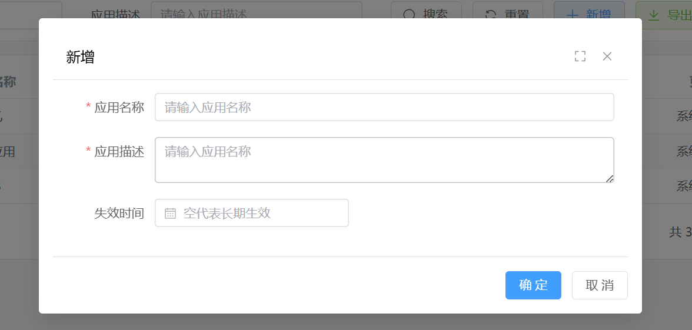
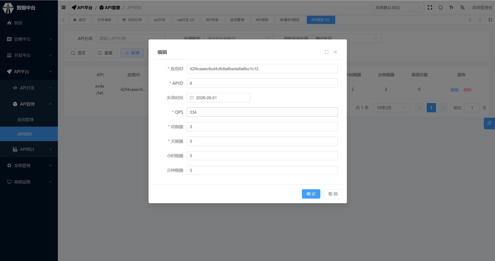
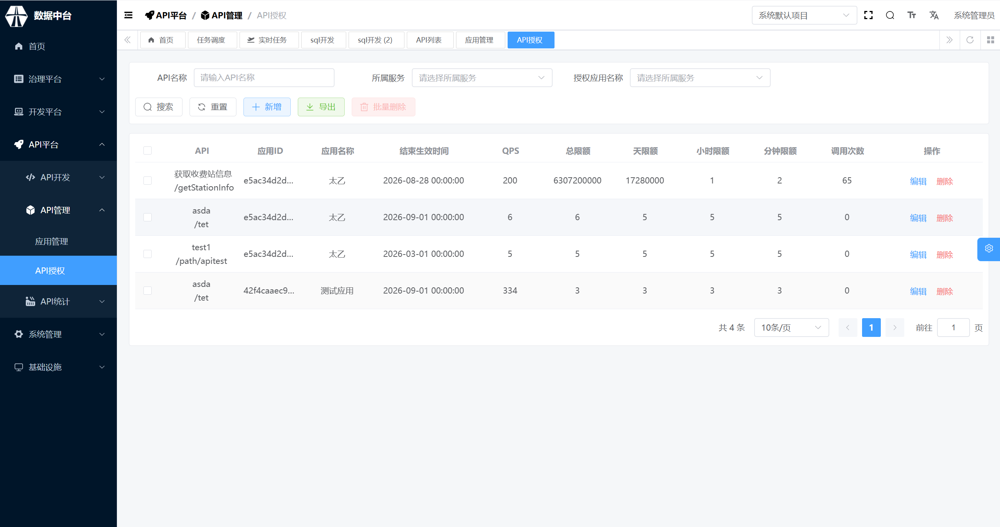

# 应用管理

新增应用 在API平台页面，单击API管理>应用管理>新增，填写信息与失效时间，点击确定。创建成功后，系统会为该应用分配一对ID和密钥。

# API授权

新增授权 在API平台页面，点击API管理>API授权
1）选择相应服务下需要授权的API 
2）选择此API授权的对应应用，设置过期时间与QPS并确认授权

在新增API授权中可对已授权应用进行更细致的限制，除API授权的对应应用，设置过期时间与QPS外，限制总访问次数、每分钟、小时、天最大访问次数。

示例

